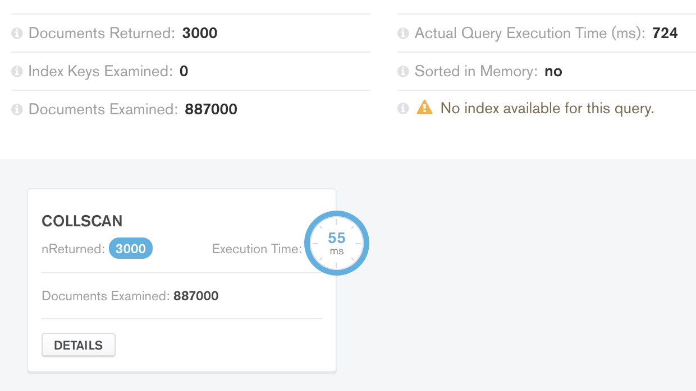
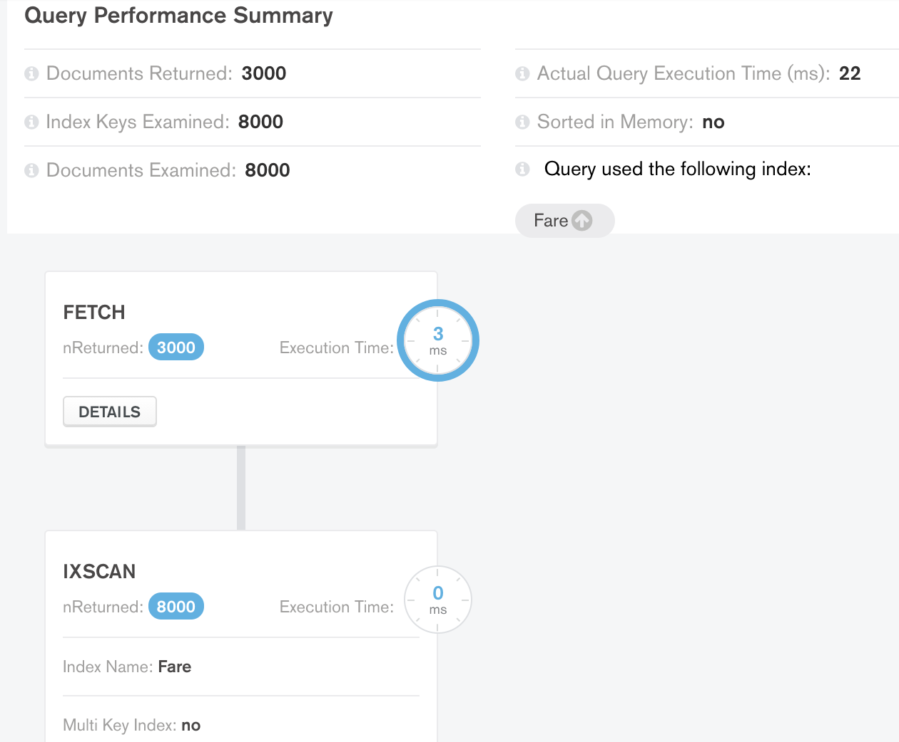
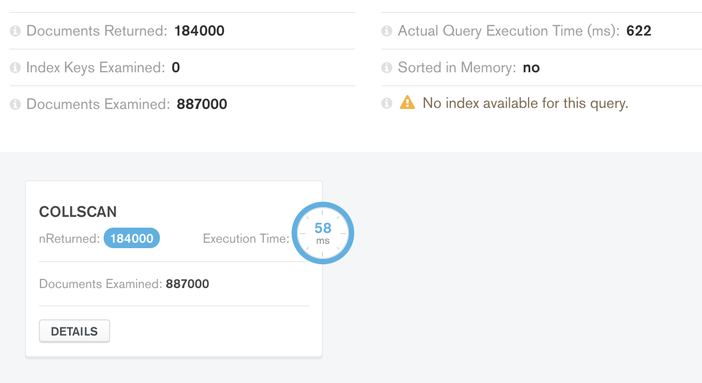
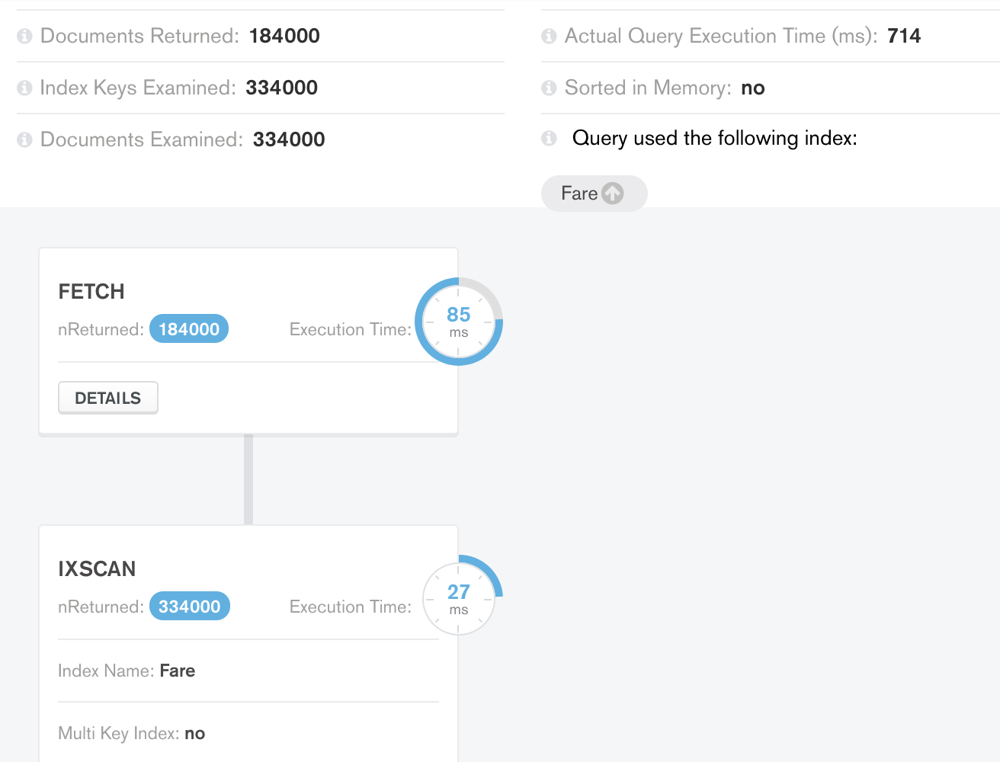

# Поднятие базы и заполнение 
`docker-compose build && docker-compose up -d` из директории `./hw1`
# Запросы
### Выборка данных
`select1.json`
```
{
    "Fare": {
        "$gt": 25,
        "$lt": 26
    }, 
    "Sex": "male"
}
```
Без индексов

С `ASC` индексом на `Fare`

Запрос возвращает небольшое число докуметов. Очевидно что забать немного данных быстрее имея сортировку по нужному полю, что и видим.

`select2.json`
```
{
    "Fare": {
        "$gt": 25,
        "$lt": 26
    }, 
    "Sex": "male"
}
```
Без индексов

С `ASC` индексом на `Fare`

Здесь данных возвращается порядка размера всей базы, поэтому индекс не сильно помогает, и даже ухудшает немного, что видим.
