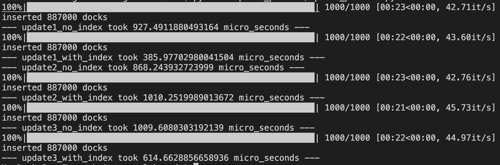

# Поднятие базы и заполнение 
`docker-compose build && docker-compose up -d` из директории `./hw1`
# Запросы
### Выборка данных
`select1.json`
```
{
    "Fare": {
        "$gt": 25,
        "$lt": 26
    }, 
    "Sex": "male"
}
```
Без индексов

С `ASC` индексом на `Fare`

Запрос возвращает небольшое число докуметов. Очевидно что забать немного данных быстрее имея сортировку по нужному полю, что и видим.

`select2.json`
```
{
    "Fare": {
        "$gt": 25,
        "$lt": 26
    }, 
    "Sex": "male"
}
```
Без индексов

С `ASC` индексом на `Fare`

Здесь данных возвращается порядка размера всей базы, поэтому индекс не сильно помогает, и даже ухудшает немного, что видим.

`select3.json`
У монги есть полнотекстовый поиск, но для него нужен индекс, поэтому без индекса заменяем его регуляркой. Ищем людей у которых есть `Williams` в составе `Name`.
```
[
    {
        "Name": { "$regex": ".*Williams( |-|$)" }
    },
    {
        "$text": { "$search": "\"Williams\"" }
    }
]
```
Без индексов

С `text` индексом на `Name`

Как видим, в случае регулярки проходимся по всей базе регуляркой и это очень долго, с полнотекстовым индексом быстрее, но понятно что возможности регулярок шире, но в данном случае при поиске конкретной фамилии или ее части полнотекстовый индекс молодец.

Теперь для `update`, вот свобдка результатов замеров


Как видимо в случае `update1` у нас большую часть времени составляет поиск записей для редактирования и с индексом получается быстрее.

В случае `update2` мы изменяем поле на котором строится полнотекстовый индекс, и его обновление как видим занимает время.

В случае `update3` мы не трогаем поле с текстом в обновлении, поэтому видим что просто искалось быстрее благодоря индексу.
