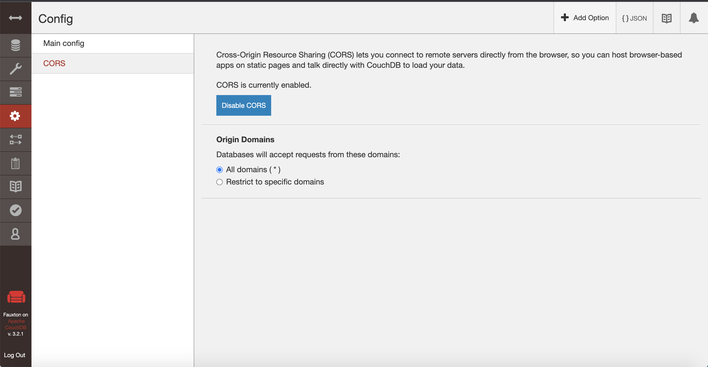

Используем образ

`docker pull couchdb`

`docker run -e COUCHDB_USER=admin -e COUCHDB_PASSWORD=password -p 5984:5984 -d couchdb`

Выполняем `create_db.http`, `add_name.http`

Пофиксим CORS

Результат в `ДЗ_2.html`
 