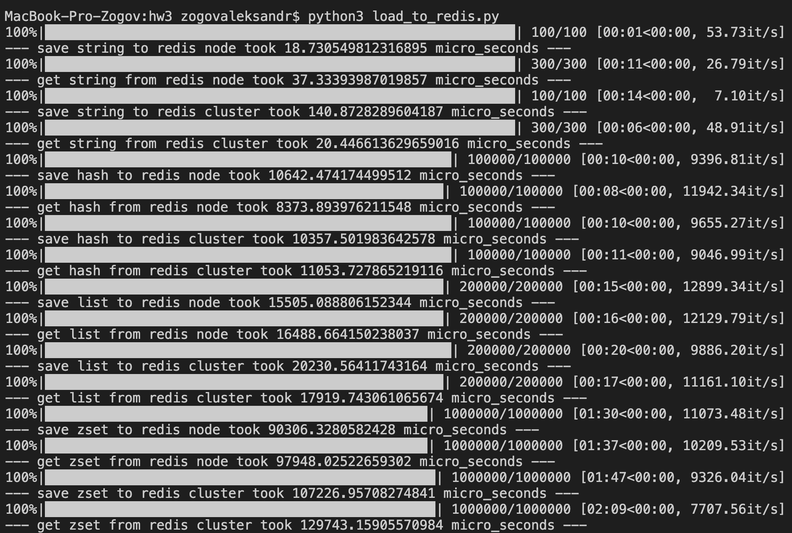

Создаем ноды, 6 штук локально (и еще 1 ноду отдельно), вообще правильно было бы по 2 ноды мастер и чужой слейв на 3 машины, но тут тоже отказоустойчиво всмысле падения одного из редисов

`./run_nodes.sh`

`redis-cli --cluster create 127.0.0.1:8001 127.0.0.1:8002 127.0.0.1:8003 127.0.0.1:8004 127.0.0.1:8005 127.0.0.1:8006 --cluster-replicas 1`

Вот полчаем для разных и типов на кластере и без вот такие числа
Поскольку тестировали однопоточно и на одной физической машине, то
профита от кластера не ощущаем, хорошо бы попробовать запустить кластер
на 3х физически разных машинах

