a. RethinkDB is the first open-source, scalable JSON database built from the ground up for the realtime web. It inverts the traditional database architecture by exposing an exciting new access model – instead of polling for changes, the developer can tell RethinkDB to continuously push updated query results to applications in realtime. RethinkDB’s realtime push architecture dramatically reduces the time and effort necessary to build scalable realtime apps.

For example, when a user changes the position of a button in a collaborative design app, the server has to notify other users that are simultaneously working on the same project. Web browsers support these use cases via WebSockets and long-lived HTTP connections, but adapting database systems to realtime needs still presents a huge engineering challenge.

RethinkDB is a free and open-source, distributed document-oriented database originally created by the company of the same name. The database stores JSON documents with dynamic schemas, and is designed to facilitate pushing real-time updates for query results to applications. Initially seed funded by Y Combinator in June 2009,[2] the company announced in October 2016 that it had been unable to build a sustainable business and its products would in future be entirely open-sourced without commercial support.[3]

RethinkDB was founded in 2009, and open-sourced at version 1.2 in 2012.[5] In 2015, RethinkDB released version 2.0, announcing that it was production-ready.[6] On October 5, 2016, the company announced it was shutting down, transitioning members of its engineering team to Stripe, and would no longer offer production support.[7][8] On February 6, 2017, The Cloud Native Computing Foundation purchased the rights to the source code and relicensed it under the Apache License 2.0.[9][10]

b. Web inerface

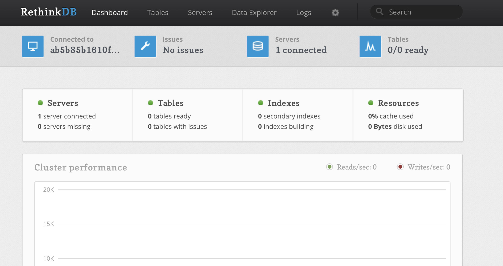

Drivers

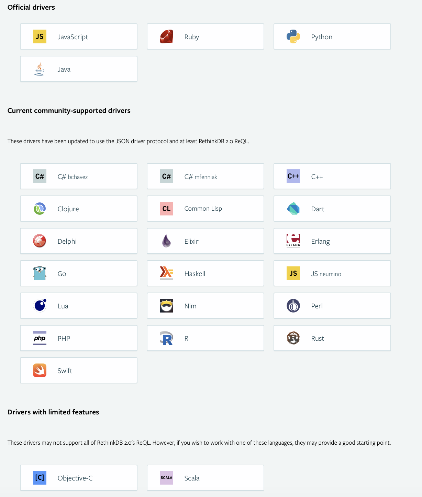

c. Implementing efficient realtime push architecture required redesigning most database components, including the query execution engine, the distributed system, the caching subsystem, and the storage engine. Because the architecture affects every database component, RethinkDB has been implemented in C++ from scratch. RethinkDB was built over five years by a team of database experts with the help of hundreds of contributors from around the world.

d. 
Simple queries

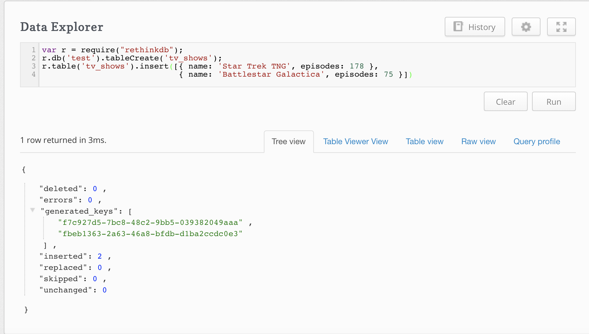
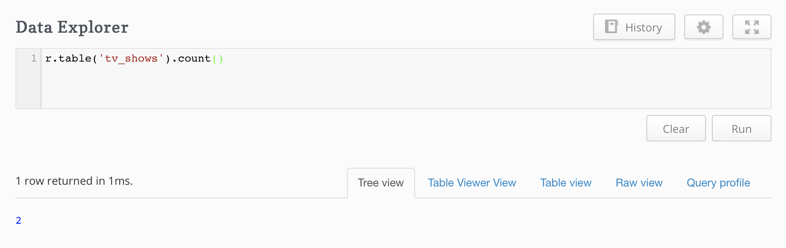
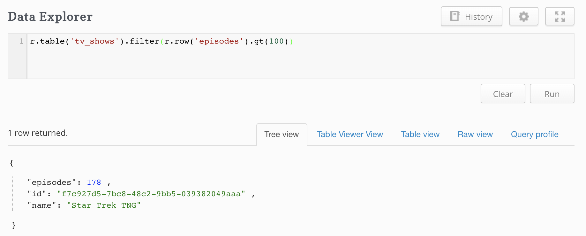

Nested field

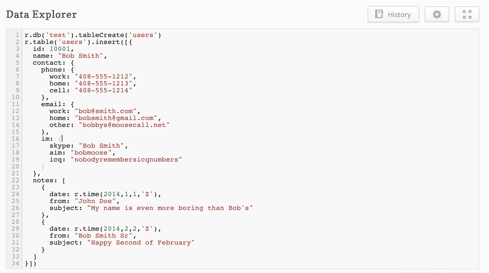
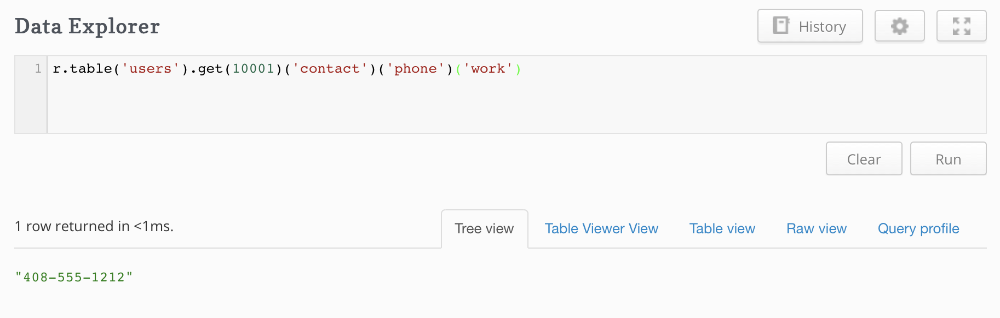

Join

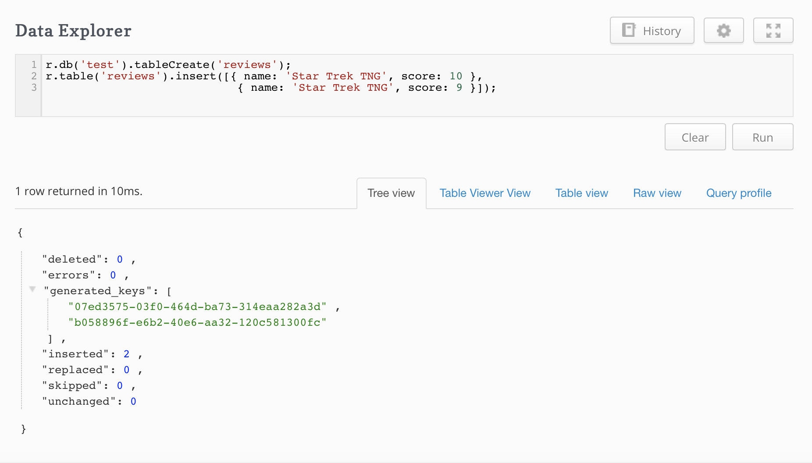
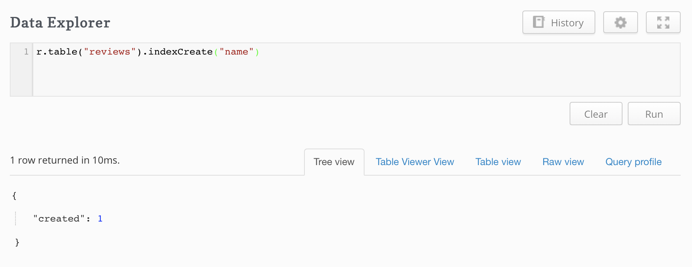
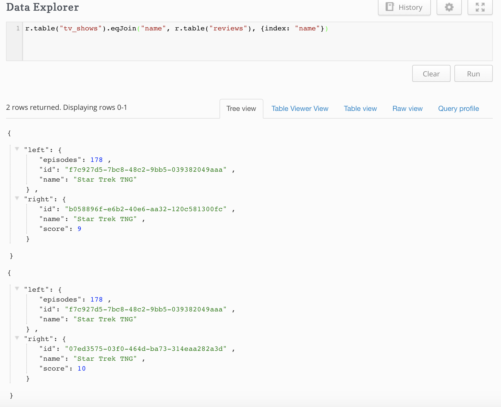

e.
How is data stored on disk?

The data is organized into B-Trees, and stored on disk using a log-structured storage engine built specifically for RethinkDB and inspired by the architecture of BTRFS. The storage engine has a number of benefits over other available options, including an incremental, fully concurrent garbage compactor, low CPU overhead and very efficient multicore operation, a number of SSD optimizations, instantaneous recovery after power failure, full data consistency in case of failures, and support for multiversion concurrency control.

The storage engine is used in conjunction with a custom, B-Tree-aware caching engine which allows file sizes many orders of magnitude greater than the amount of available memory. RethinkDB can operate on a terabyte of data with about ten gigabytes of free RAM.

How does RethinkDB handle data corruption?

It relies on the underlying storage system to ensure data consistency. RethinkDB does not perform additional checksums on stored data. It is, however, compatible with file systems which do guarantee data integrity, such as ZFS.

Which file systems are supported?

RethinkDB supports most commonly used file systems. It optionally supports direct disk I/O for greater efficiency, but this is not enabled by default.

f. C++

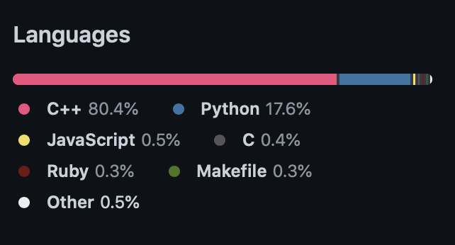

g. 
Simple indexes

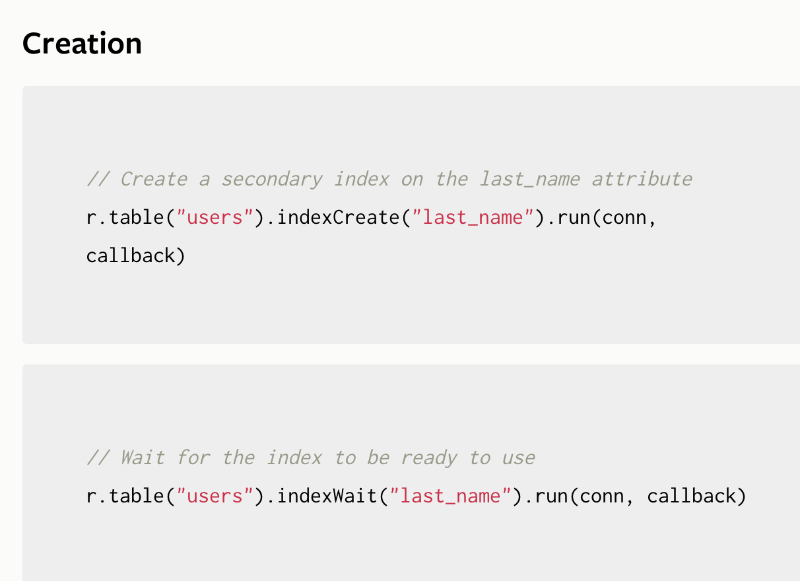
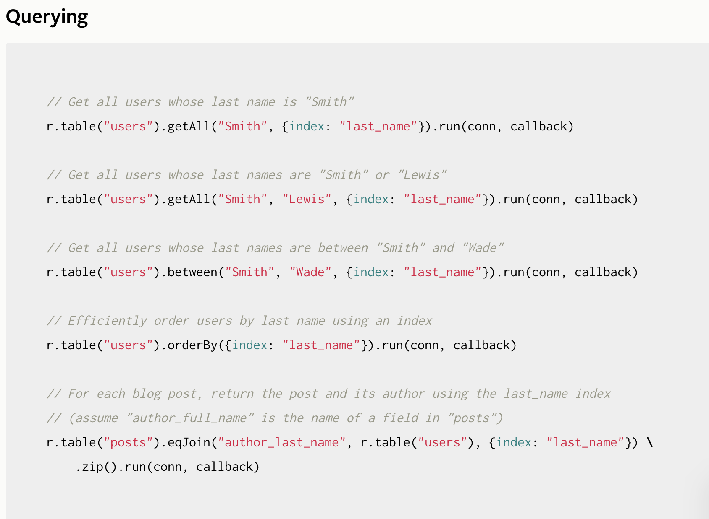

Use simple indexes to efficiently retrieve and order documents by the value of a single field.

Compound indexes

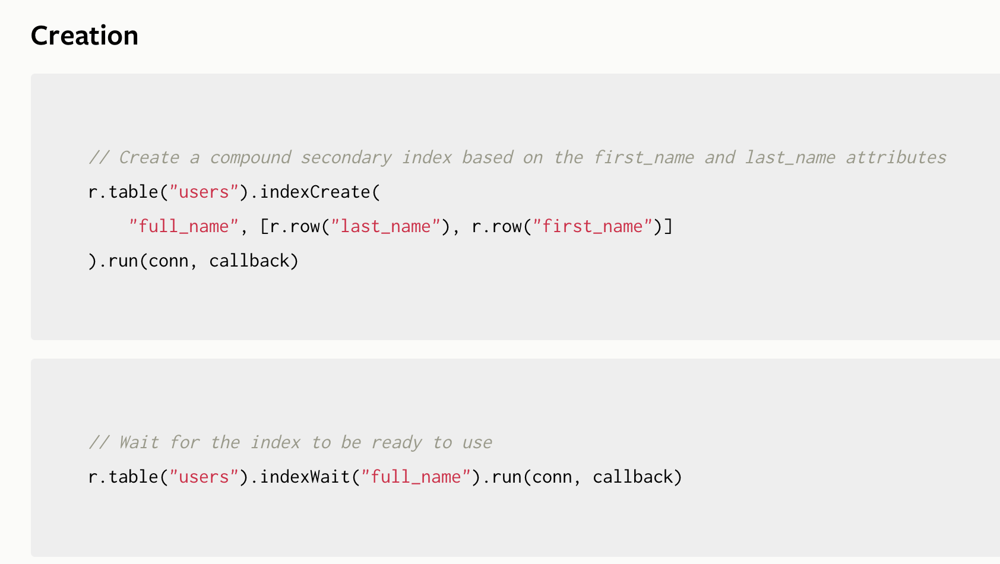
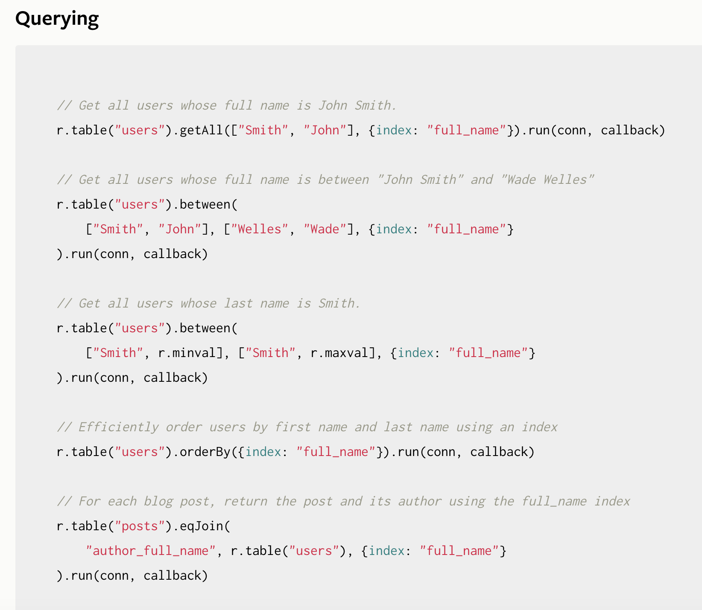

Compound indexes use arrays to efficiently retrieve documents by multiple fields.

Internally, compound indexes and simple indexes are the same type of index in RethinkDB; compound indexes are simply a special case of regular index that returns an array rather than a single value. Note that this affects sorting: compound index values are sorted lexicographically, with the first (leftmost) elements of the compound value being more significant than the last (rightmost) ones. Therefore, using the full_name index, the above example “all users whose last name is Smith” only works for the last_name field. Searching by first_name with a query like between([r.minval, "John"], [r.maxval, "John"], {index: "full_name"}) would effectively select every user in the table, except (theoretically) users that have r.minval as last name and a first name lexicographically smaller than “John” (or the reverse for r.maxval).

Multi indexes

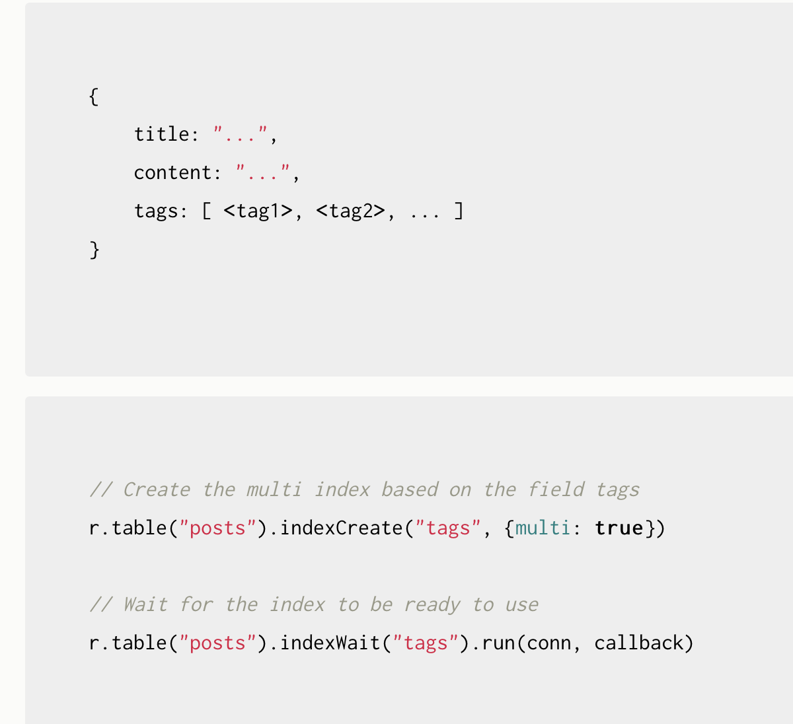
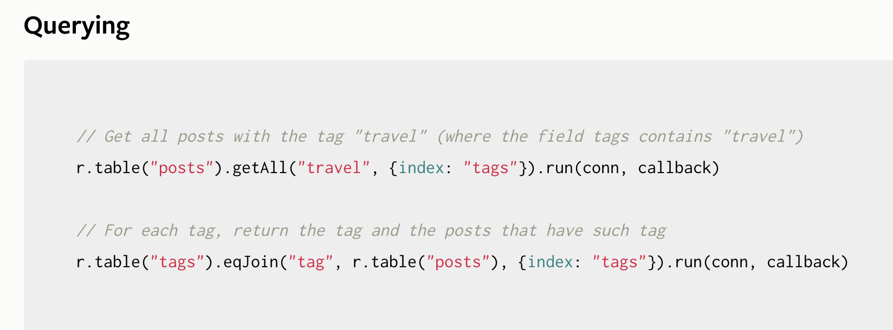

With simple and compound indexes, a document will be indexed using at most one index key: a single value for a simple index and a set of values for a compound index. Multiple documents may have the same index key. With a multi index, a document can be indexed using more than one key in the same index. For instance, a blog post might have multiple tags, and each tag might refer to multiple blog posts.

The keys in a multi index can be single values, compound values or even arbitrary expressions. (See the section below for more detail on indexes using functions.) What matters is that the “multi-value” that gets indexed is an array: the document will be referenced in the index multiple times, one for each element of this array.

h. 
