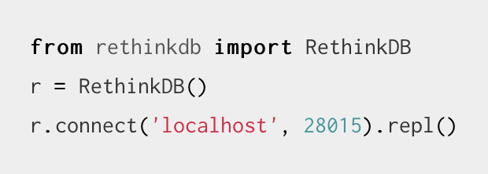

`docker run -d -P --name rethink1 rethinkdb`

a. 
RethinkDB is the first open-source, scalable JSON database built from the ground up for the realtime web. It inverts the traditional database architecture by exposing an exciting new access model – instead of polling for changes, the developer can tell RethinkDB to continuously push updated query results to applications in realtime. RethinkDB’s realtime push architecture dramatically reduces the time and effort necessary to build scalable realtime apps.

For example, when a user changes the position of a button in a collaborative design app, the server has to notify other users that are simultaneously working on the same project. Web browsers support these use cases via WebSockets and long-lived HTTP connections, but adapting database systems to realtime needs still presents a huge engineering challenge.

RethinkDB is a free and open-source, distributed document-oriented database originally created by the company of the same name. The database stores JSON documents with dynamic schemas, and is designed to facilitate pushing real-time updates for query results to applications. Initially seed funded by Y Combinator in June 2009,[2] the company announced in October 2016 that it had been unable to build a sustainable business and its products would in future be entirely open-sourced without commercial support.[3]

RethinkDB was founded in 2009, and open-sourced at version 1.2 in 2012.[5] In 2015, RethinkDB released version 2.0, announcing that it was production-ready.[6] On October 5, 2016, the company announced it was shutting down, transitioning members of its engineering team to Stripe, and would no longer offer production support.[7][8] On February 6, 2017, The Cloud Native Computing Foundation purchased the rights to the source code and relicensed it under the Apache License 2.0.[9][10]

b.
Web inerface

Python lib

