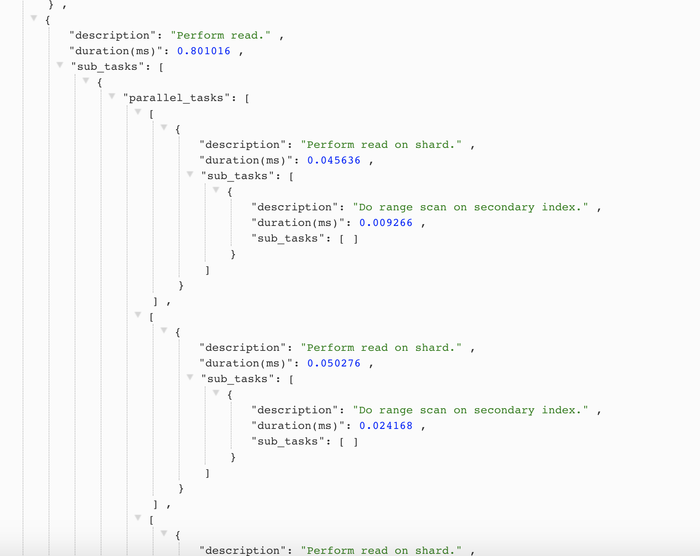

a. RethinkDB is the first open-source, scalable JSON database built from the ground up for the realtime web. It inverts the traditional database architecture by exposing an exciting new access model – instead of polling for changes, the developer can tell RethinkDB to continuously push updated query results to applications in realtime. RethinkDB’s realtime push architecture dramatically reduces the time and effort necessary to build scalable realtime apps.

For example, when a user changes the position of a button in a collaborative design app, the server has to notify other users that are simultaneously working on the same project. Web browsers support these use cases via WebSockets and long-lived HTTP connections, but adapting database systems to realtime needs still presents a huge engineering challenge.

RethinkDB is a free and open-source, distributed document-oriented database originally created by the company of the same name. The database stores JSON documents with dynamic schemas, and is designed to facilitate pushing real-time updates for query results to applications. Initially seed funded by Y Combinator in June 2009,[2] the company announced in October 2016 that it had been unable to build a sustainable business and its products would in future be entirely open-sourced without commercial support.[3]

RethinkDB was founded in 2009, and open-sourced at version 1.2 in 2012.[5] In 2015, RethinkDB released version 2.0, announcing that it was production-ready.[6] On October 5, 2016, the company announced it was shutting down, transitioning members of its engineering team to Stripe, and would no longer offer production support.[7][8] On February 6, 2017, The Cloud Native Computing Foundation purchased the rights to the source code and relicensed it under the Apache License 2.0.[9][10]

b. Web inerface

Drivers

c. Implementing efficient realtime push architecture required redesigning most database components, including the query execution engine, the distributed system, the caching subsystem, and the storage engine. Because the architecture affects every database component, RethinkDB has been implemented in C++ from scratch. RethinkDB was built over five years by a team of database experts with the help of hundreds of contributors from around the world.

d. 
Simple queries

Nested field

Join

e.
How is data stored on disk?

The data is organized into B-Trees, and stored on disk using a log-structured storage engine built specifically for RethinkDB and inspired by the architecture of BTRFS. The storage engine has a number of benefits over other available options, including an incremental, fully concurrent garbage compactor, low CPU overhead and very efficient multicore operation, a number of SSD optimizations, instantaneous recovery after power failure, full data consistency in case of failures, and support for multiversion concurrency control.

The storage engine is used in conjunction with a custom, B-Tree-aware caching engine which allows file sizes many orders of magnitude greater than the amount of available memory. RethinkDB can operate on a terabyte of data with about ten gigabytes of free RAM.

How does RethinkDB handle data corruption?

It relies on the underlying storage system to ensure data consistency. RethinkDB does not perform additional checksums on stored data. It is, however, compatible with file systems which do guarantee data integrity, such as ZFS.

Which file systems are supported?

RethinkDB supports most commonly used file systems. It optionally supports direct disk I/O for greater efficiency, but this is not enabled by default.

f. C++

g. 
Simple indexes

Use simple indexes to efficiently retrieve and order documents by the value of a single field.

Compound indexes

Compound indexes use arrays to efficiently retrieve documents by multiple fields.

Internally, compound indexes and simple indexes are the same type of index in RethinkDB; compound indexes are simply a special case of regular index that returns an array rather than a single value. Note that this affects sorting: compound index values are sorted lexicographically, with the first (leftmost) elements of the compound value being more significant than the last (rightmost) ones. Therefore, using the full_name index, the above example “all users whose last name is Smith” only works for the last_name field. Searching by first_name with a query like between([r.minval, "John"], [r.maxval, "John"], {index: "full_name"}) would effectively select every user in the table, except (theoretically) users that have r.minval as last name and a first name lexicographically smaller than “John” (or the reverse for r.maxval).

Multi indexes

With simple and compound indexes, a document will be indexed using at most one index key: a single value for a simple index and a set of values for a compound index. Multiple documents may have the same index key. With a multi index, a document can be indexed using more than one key in the same index. For instance, a blog post might have multiple tags, and each tag might refer to multiple blog posts.

The keys in a multi index can be single values, compound values or even arbitrary expressions. (See the section below for more detail on indexes using functions.) What matters is that the “multi-value” that gets indexed is an array: the document will be referenced in the index multiple times, one for each element of this array.

h.i. When a node in the cluster receives a query from the client, it evaluates the query in the following way.

First, the query is transformed into an execution plan that consists of a stack of internal logical operations. The operation stack fully describes the query in a data structure useful for efficient execution. The bottom-most node of the stack usually deals with data access— it can be a lookup of a single document, a short range scan bounded by an index, or even a full table scan. Nodes closer to the top usually perform transformations on the data – mapping the values, running reductions, grouping, etc. Nodes can be as simple as projections (i.e. returning a subset of the document), or as complex as entire stacks of stacks in case of subqueries.

Each node in the stack has a number of methods defined on it. The three most important methods define how to execute a subset of the query on each server in the cluster, how to combine the data from multiple servers into a unified resultset, and how to stream data to the nodes further up in small chunks.

As the client attempts to stream data from the server, these stacks are transported to every relevant server in the cluster, and each server begins evaluating the topmost node in the stack, in parallel with other servers. On each server, the topmost node in the stack grabs the first chunk of the data from the node below it, and applies its share of transformations to it. This process proceeds recursively until enough data is collected to send the first chunk to the client. The data from each server is combined into a single resultset, and forwarded to the client. This process continues as the client requests more data from the server.

The two most important aspects of the execution engine is that every query is completely parallelized across the cluster, and that queries are evaluated lazily. For instance, if the client requests only one document, RethinkDB will try to do just enough work to return this document, and will not process every shard in its entirety. This allows for large, complicated queries to execute in a very efficient way.

The full query execution process is fairly complex and nuanced. For example, some operations cannot be parallelized, some queries cannot be executed lazily (which has implications on runtime and RAM usage), and implementations of some operations could be significantly improved. We will be adding tools to help visualize and understand query execution in a user-friendly way, but at the moment the best way to learn more about it is to ask us or to look at the code.

j. Most write operations involving a single document in RethinkDB are guaranteed to be atomic. Operations that are not deterministic cannot update documents in an atomic fashion (such as random values, or values obtained as the result of a subquery). In addition, multiple documents are not updated atomically.

k. Backup

Use the dump subcommand to create an archive of data from the cluster. This creates a tar.gz file consisting of JSON documents and additional table metadata.

Since the backup process uses client drivers, it takes advantage of RethinkDB’s concurrency. While it will use some cluster resources, it won’t lock out any clients, and it can be safely run on a live cluster.

Restore

The restore subcommand has most of the the same options and defaults as the dump command, although there are a few extra commands for controlling how data is imported.

l. RethinkDB uses a range sharding algorithm parameterized on the table’s primary key to partition the data. When the user states they want a given table to use a certain number of shards, the system examines the statistics for the table and finds the optimal set of split points to break up the table evenly. All sharding is currently done based on the table’s primary key, and cannot be done based on any other attribute (in RethinkDB the primary key and the shard key are effectively the same thing).

Split points will not automatically be changed after table creation, which means that if the primary keys are unevenly distributed, shards may become unbalanced. However, the user can manually rebalance shards when necessary, as well as reconfigure tables with new sharding and replication settings. Users cannot set split points for shards manually.

